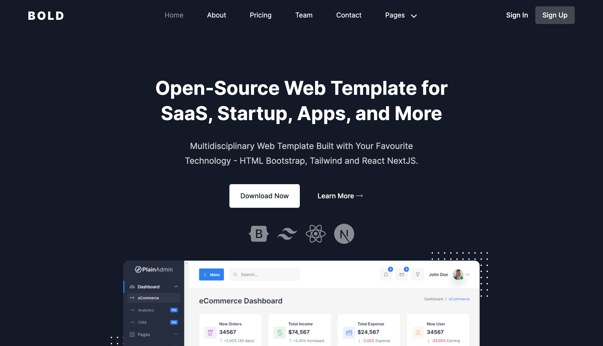

<h1 align=center>BOLD Bootstrap Template | <a href="https://den-front.github.io/showcases/bold-bootstrap-template/index.html" rel="nofollow">Demo</a></h1>

<h4 align=center>☄️ Fast | ☁️ Fluent | 🌙 Smooth | 📱 Responsive</h4>
<br>



BOLD is a **Bootstrap** template that includes all the necessary blocks for a startup site, SaaS product site, blog, and more. It is fully responsive, fast, and smooth, built with **Pug.js** and **Sass** technology, and bundled with **Parcel** bundler.

This is my pet project for practice, and I have made sure to create clean and reusable components that can be easily customized to fit any project's needs.

<h2>Features</h2>

- Landing page
- Blog page
- Single Post page
- Login page
- Contact page
- About page
- 404 page
- Price section
- Team section
- Testimonials section
- FAQ section
- Scroll to top
- Smooth animations

<h2>Customizing the Template</h2>

The BOLD Bootstrap template is highly customizable, and you can easily make changes to the code to fit your specific project's needs. The template is built with clean and reusable components that are easy to modify.

<h2>Getting Started</h2>

To get started with the BOLD Bootstrap template, simply clone the repository and install the dependencies:

```bash
git clone https://github.com/den-front/bold-bootstrap-template.git
cd bold-bootstrap-template
yarn install
```

Once the dependencies are installed, you can start the development server by running:

```bash
yarn start
```

<h2>Credits</h2>

The BOLD Bootstrap template was built using the following technologies:

- Bootstrap
- Pug.js
- Sass
- Parcel
